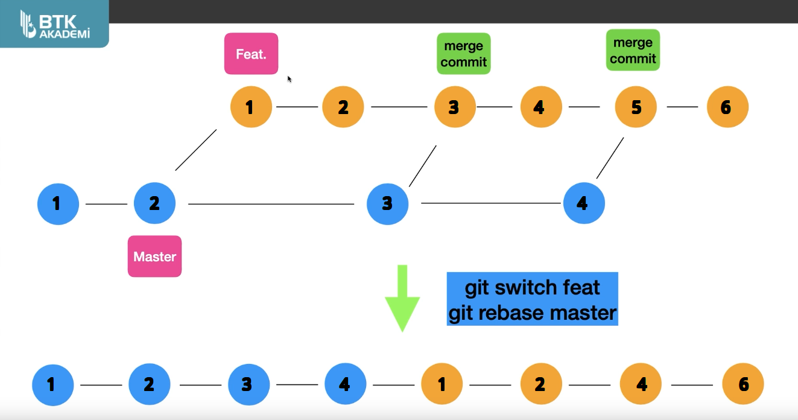

<details>
	<summary>İçindekiler</summary>

+ [Giriş ve Kurulumlar](#Giriş-ve-Kurulumlar)
	+ [Git Kurulumu](#Git-Kurulumu)
	+ [Terminal Kullanımı](#Terminal-Kullanımı)
	+ [Kullanıcı Adı ve Email Girmek](#Kullanıcı-Adı-ve-Email-Girmek)
	+ [Mac ve Linux İçin Editör Ayarı](#Mac-ve-Linux-İçin-Editör-Ayarı)

+ [Git Temelleri](#Git-Temelleri)
	+ [Git Init ve Status](#Git-Init-ve-Status)
	+ [İlk Commit](#İlk-Commit)
	+ [Git Log](#Git-Log)
	+ [Gitignore](#Gitignore)

+ [Git Branch](#Git-Branch)
	+ [HEAD Nedir?](#HEAD-Nedir)
	+ [Merge](#Merge)
	+ [Fast Forward](#Fast-Forward)
	+ [Merge Conflict](#Merge-Conflict)
	+ [Stash](#Stash)
	+ [Pop](#Pop)

+ [Geçmişe Dönmek](#Geçmişe-Dönmek)
	+ [Checkout](#Checkout)
	+ [Reset vs Revert](#Reset-vs-Revert)
	+ [Git Diff](#Git-Diff)
	+ [Rebase](#Rebase)

+ [GitHub](#GitHub) 
	+ [GitHub İlk Repo](#GitHub-İlk-Repo)
	+ [GitHub Push](#GitHub-Push)
	+ [Pull Request](#Pull-Request)
	+ [Fetch ve Pull](#Fetch-ve-Pull)
	+ [Clone](#Clone)
	+ [Fork](#Fork)
	+ [Private](#Private)

</details>

## Giriş ve Kurulumlar

### Git Kurulumu

Git'in yüklü olup olmadını anlamak için terminalde `git` komutunu çalıştırıp help dökümantasyonunun çalışıp çalışmadığına bakabilirsin. 

Eğer yüklü değilse [Git - Downloads linki](https://git-scm.com/downloads) ile kurulumu gerçekleştirebilirsin.

Git'in hangi versiyonda olduğunu görmek:
```bash
git --version
```

### Terminal Kullanımı

+ `ls` : Bulunduğunuz konumdaki klasör ve dosyaları listeler.
+ `ls -la` : Bulunduğunuz konumu gizli dosyalarla birlikti listeler.
+ `pwd` : Bulunduğunuz dosya konumunu gösterir.
+ `cd` : Klasör değiştirmek için kullanılır.
+ `cd Belgeler` : "Belgeler" klasörüne gider.
+ `cd ..` : Bir önceki klasöre gider.
+ `clear` : Terminal ekranını temizler.
+ `mkdir folder_name` : Klasör oluşturmak.
+ `touch file_name.txt` : Dosya oluşturmak.
+ `rm file_name.txt` : Dosya kaldırmak.
+ `rm -rf folder_name` : Klasör kaldırmak.

**NOT** : Terminal kullanırken "**Tab**" tuşuna basmak yarım kalan kodu otomatik olarak tamamlar.

### Kullanıcı Adı ve Email Girmek

Git username bilgisi girmek:
```bash
git config --global user.name "Username"
```

Git username bilgisini kontrol etmek:
```bash
git config user.name
```

Git email bilgisi girmek:
```bash
git config --global user.email "User Email"
```

Git email bilgisini kontrol etmek:
```bash
git config user.email
```

### Mac ve Linux İçin Editör Ayarı

Git için default/varsayılan editörü (Örnek Editör: Gedit) seçmek:
```bash
git config --global core.editor "gedit --wait --new-window"
```

## Git Temelleri

### Git Init ve Status

Git'in güncel durumunu görmek:
```bash
git status
```

Klasörü Git'e bağlamak:
```bash
git init
```

**NOT** : `git status` çalıştırıldığında eğer git reposu yok gibi bir hata almıyorsan, `git init` çalıştırılmamalısın. Aksi halde kafası karışabilir / çakışma olabilir.

Yanlışıkla eklenen Git'i kaldırmak:
```bash
rm -rf .git
```

### İlk Commit

İstenen değişikliği (note.txt) index'lemek:
```bash
git add note.txt
```

Klasörde bulunan bütün değişiklikleri index'lemek:
```bash
git add .
```

İndex'lenen değişiklikleri commit'lemek:
```bash
git commit -m "Commit mesajı"
```

**NOT** : Commit mesajı zorunludur. Terminal üzerinde commit mesajı girebilmek için `-m` kullanabilirsin, aksi taktirde commit mesajı girmek için varsayılan editör açılır.

### Git Log

Commit kayıtlarını görmek:
```bash
git log
```

**NOT** : `git log` çıktısı çok uzun ise "q" tuşuna basarak çıkış yapabilirsin.

Git Log çıktısı:
```
isaylmz@NIRVANA:~/Masaüstü/Repositories/GitHub$ git log
commit 614179c5976f98ff5d21d4fc6c0bd970d186de6b (HEAD -> main)
Author: İsa Yılmaz <isaylmz@mail.com>
Date:   Fri May 16 00:02:11 2025 +0300

    Commit Mesajı
```

**NOT** : Her Commit'in kendine ait bit hesh'i (`commit 614179c5976f98ff5d21d4fc6c0bd970d186de6b` = `commit hesh`) vardır.

Her şeyi direk index'leyip commit atmak:
```bash
git commit -a
```

### Gitignore

Takip edilmesi istenmediğin dosya ve klasörleri belirtmek için kullanılır. Gitignore içerisine dosya yolları alt alta olacak şekilde yazılır.

```bash
touch .gitignore
```

## Git Branch

### HEAD Nedir?

Commitler içerisinde bulunduğun konumu gösterir.

### Merge

Yeni branch açmak:
```bash
git branch branch_name
```

**NOT** : Branch projenin bir kopyasını / yeni bir dalını oluşturmanı ve o dal üzerinde çalışmaya devam etmeni sağlar. Bu sayede projeyi tehlikeye atmadan farklı bir çalışma alanında proje üzerinde geliştirmeler yapabilirsin.

Güncel branch'leri listelemek:
```bash
git branch
```

Branch değiştirmek:
```bash
git switch branch_name
```

Branch'leri birleştirmek:
```bash
git merge branch_name
```

**NOT** : `merce` komutu, adını yazdığın branch'i bulunduğun branch ile birleştirir. main branch'e döndükten sonra çalıştırman durumunda, adını yazdığınız branch'i main branch ile birleştirir.

### Fast Forward

Yeni branch üzerinde çalışmaya devap edip commit'ler atmak ve main branch üzerinde değişiklik yapmadan yeni branch ile birleştirmek. Birleştirme sonrasında Merge Commit dahi oluşmaz. Bu işleme "Fast Forward" denir.

### Merge Conflict

İki farklı branch alanında çalışırken aynı dosya üzerinde değişiklik yapılması durumunda, branchleri birleştirmeye çalışırken çakışma yani "Conflict" olur.

Conflict'i çözmek için: Hangi değişikliklerin geçerli olacağına karar vermen ve projeye uygulayıp kaydetmen gerekir.

### Stash

Commit edilmeyen değişikliğin Stash adı verilen ayrı bir yerde saklanmasını sağlar.

**NOT** : Proje üzerinde çalışırken yeni dosya ekleyip commit atmadan main branche döndüğünde, çakışma olmayan yeni bir dosya olduğu için main branchde görünür ve commit edilebilir.

**Senaryo** : Çalışmanı tamamlamadan / Commit etmeye hazır olmadan branch değiştirmen gerekmesi durumunda uygulayabileceğin 3 seçenek var.

1. Commit etmek.
2. Değişiklikten vazgeçmek.

Dosyayı en son commit'teki haline geri döndürmek:
```bash
git restore file_name.txt
```

3. 
Stash yapmak:
```bash
git stash
```

**NOT** : Stash istenilen brach üzerinde geri alınabilir / uygulanabilir.

### Pop

Stash listeden atarak projeye uygulamak:
```bash
git stash pop
```

Stash listeden atmadan projeye uygulamak:
```bash
git stash apply
```

Stash'leri listelemek:
```bash
git stash list
```

Stash'lerden birini projeye uygulamak:
```bash
git stash apply stash@{0}
```

Bütün Stash'leri silmek:
```bash
git stash clear
```

## Geçmişe Dönmek

### Checkout

Seçilen Commit'e geri dönmek:
```bash
git checkout commit_hesh
```

`git branch` çıktısı:
```
isaylmz@NIRVANA:~/Masaüstü/file_name$ git branch 
* (HEAD detached at 614179c)
  main
```

**NOT** : `checkout` komutunu çalıştırman durumunda, HEAD kopmuş (detached HEAD olmuş) projenin son halinden farklı bir konuma geçmiş olur. Bu durumu düzeltebilmek için geri dönmek ya da yeni brach açmak gerekir.

Geri dönmek:
```bash
git switch main
```

### Reset vs Revert

İçeriği değiştirmeden seçilen Commit'e geri dönmek ve sonraki Commit'leri silmek:
```bash
git reset commit_hesh
```

İçerik ve konum olarak seçilen Commit'e geri dönmek ve sonraki Commit'leri silmek:
```bash
git reset --hard commit_hesh
```

Silinen Commit'leri GitHub üzeriden kaldırmak:
```bash
git push origin +main
```

Seçilen Commit'i yapılmamış gibi geri almak ve yeni Commit atmak:
```bash
git revert commit_hesh
```

**NOT** : Commit'ler sırasıyla (Yeniden -> Eskiye Doğru) Revert edilmelidir yoksa Conflict yaşanabilir.

### Git Diff

Projenin güncel hali ile son `git add` arasında nelerin değiştiğini gösterir:
```bash
git diff
```

Projenin güncel hali ile son commit arasında nelerin değiştiğini gösterir:
```bash
git diff HEAD
```

Commit'ler arasındaki farkı görmek:
```bash
git diff commit_hesh commit_hesh
```

Branch'ler arasındaki farkı görmek:
```bash
git diff branch_name branch_name
```

### Rebase

Başka branch'te çalışırken main branch üzerinde yapılan değişiklikleri (Commit'leri) Merge ederek çalıştığın branch'e çekebilirsin fakat bu durum çalıştığın branch üzerinde gereksiz "Merge Commit" oluşmasına ve branch'inin kirlenmesine sebep olur.

Rebase işlemi main branch'inde bulunan commit'leri sıraladıktan sonra çalıştığın branch'deki commit'leri, merge commit'leri dahil etmeden sıralar. Bu durum tarih sıralamasının değişmesine sebep olur.



Taşımak istediğimiz branch'e geçmek:
```bash
git switch branch_name
```

İçerisinde olduğumuz branch'i main branch'ine taşımak:
```bash
git rebase main
```

## GitHub

### GitHub İlk Repo

Remote repo bağlantısını "origin" adı ile kaydetmek:
```bash
git remote add origin remote_url
```

main branch'inde olduğumuzdan emin olmak:
```bash
git branch -M main
```

main branch'ini remote repoya göndermek:
```bash
git push -u origin main
```

Remote bağlantıları listelemek:
```bash
git remote
```
### GitHub Push

**NOT** : `-u` bir kere kullandığında parametreleri tekrar vermene gerek kalmaz. Daha sonra 2 farklı şekilde push edilebilirsin.

```bash
git push origin branch_name
```
VEYA
```bash
git push
```

**NOT** : GitHub reposuna atılan push `git config user.email` bilgisinde yazan email adresi ile eşleşen profil tarafından yapılmış gibi görünür.

### Pull Request

+ GitHub üzerinden "Compare & pull request" butonu kullanıldığında öncelikle değişiklikleri comparing (karşılaştırma) yapar ve merge edilebildiğini (feat branch'in main branch içine alınabildiğini) gösterir.

	+ İstersen "Create pull request" (reponun sahibine bu işlemi yapması için istek) gönderilebilir.

+ Repo sahibi "Pull requests" sekmesi üzerinden gelen istekleri görür.

	+ "Merge pull request" >> "Confirm merge" seçeneği ile Pull request merge edip ve kapatabilir.

	+ "Delete branch" seçeneği ile branch'i silebilir.

**NOT** : Github üzerinden "Compare & pull request" yapıldığında remote repository local'de bulunan projenin önüne geçmiş (detached HEAD olmuş / localde bulunmayan bir merge gerçekleştirmiş) olur.

### Fetch ve Pull

Remote branch'leri görüntülemek:
```bash
git branch -r
```

Değişiklikleri local'e getirmek:
```bash
git fetch origin branch_name
```

Remote repository ile local arasındaki farkı görmek:
```bash
git status
```

Remote branch'e geçmek:
```bash
git checkout origin/branch_name
```

**NOT** : Remote branch'e geçmemiz durumunda "detached HEAD" olmuş olur.

Değişiklikleri local'e uygulamak:
```bash
git pull
```


**NOT** : `git pull` = `git fetch` + `git merge` yani değişiklikleri al ama ayrı bir branch'te tutma, direk benim branch'imin içerisine göm demek.

### Clone

Remote repoyu bilgisayara klonlamak:
```bash
git clone remote_url
```

### Fork

GitHub üzerinde "Fork" butonunu kullandığında başkasının reposunu kendi hesabına kopyalanmış olursun ve kendi hesabın üzerinden projeyi devam ettirip geliştirebilirsin.

**SENARYO** : Fork'lanan repository veya kendi repository'in üzerinde bir değişiklik olması durumunda.

GitHub üzerinden;
+ "Fetsch upstream" butonu ile fork'lanan repository üzerindeki değişiklik kendi repository'ine ekleyebilirsin.

+ "Contribute" butonu ile "Create pull request" (kendi repository'in üzerindeki değişikliği eklemesi için fork'lanan repository sahibine istek) gönderebilirsin.

Reponun sahibi;
+ "Reviev changes" >> "Cemment" seçeneği ile "Pull request" için değişiklik isteyebilir.

+ "Reviev changes" >> "Approve" seçeneği ile onay mesajı gönderebilir.

Daha sonra:
+ "Merge pull request" >> "Confirm merge" seçeneği ile "Pull request merge" edip kapatabilir.

+ "Close pull request" seçeneği ile direk kapatabilir.

### Private

**NOT** : Private Repositories sadece repository sahibi tarafından görüntülenebilir. Repository üzerinde birlikte çalışmak istediğin kişilere "Settings" >> "Collaborators" kısmından davet gönderebilirsin. Kişi daveti kabul etmesi durumunda push etme yetkisine sahip olur.